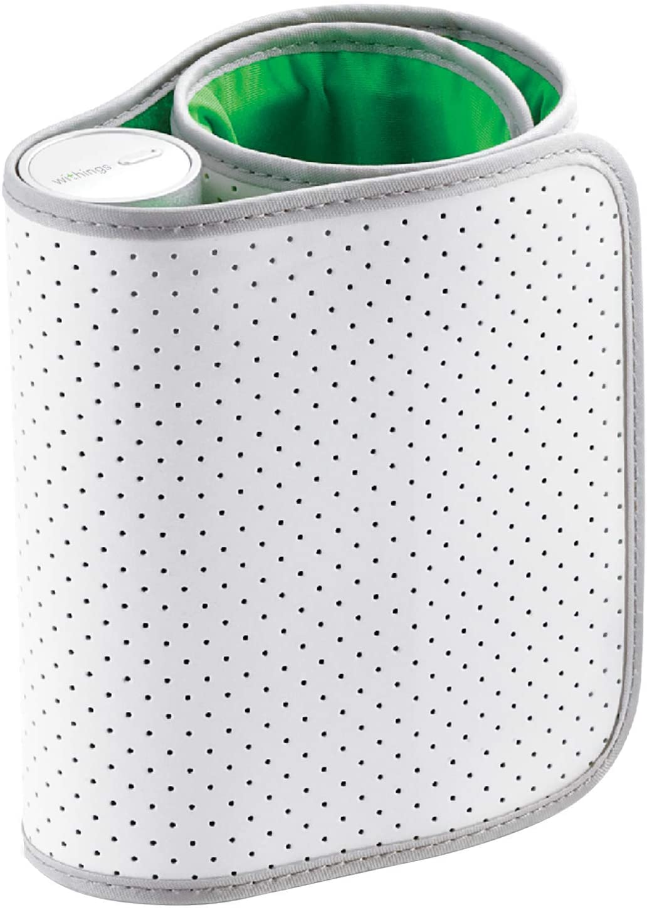
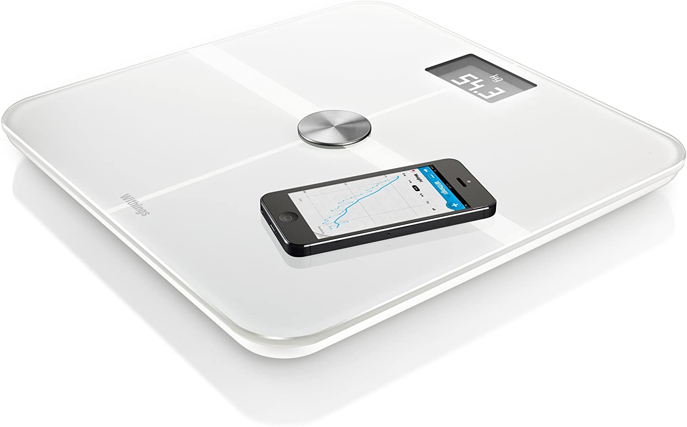
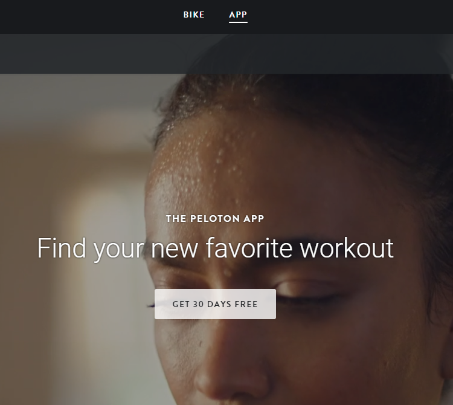
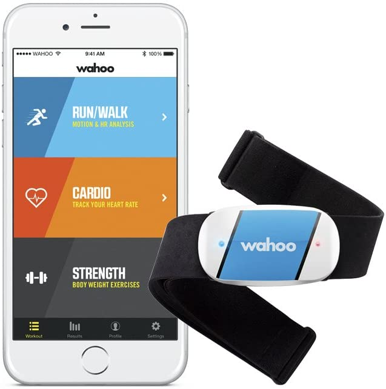
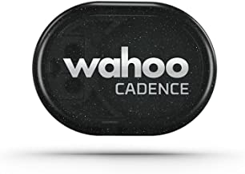

# Building a Peloton App  (2020)

COVID19 caused a turning point for myself, this site is to document a project that transformed me.

I'm a 50+ software developer who has a very sedentary life, as such at the beginning of 2020 I was closer to 18 stone than I'd like to admit. I have a gym membership but I found it increasingly hard to get myself to the gym more than one or twice a week and I wasn't really loosing any weight.

I suffer from high blood pressure, following a trip to the opticions he advise I see a doctor my blood pressure was very high it wasn't unusal for it to be 180/115, I'd often feel flushed in the face. Ther doctor put me on medication and although this seems partially an inherited disorder (both my parents take medication) I struggled to get it down much below 130/90, The medication also had side effect of making my legs swell. I just didn't feel good especially when I had to travel abroad

I'm a techie kind of guy so I'd purchased kit to measure all this stuff, I knew when I was putting on too much weight and what my PB was.

{:width="200px"}
[Blood Pressure Monitor  - Amazon Link](https://www.amazon.co.uk/Withings-Nokia-BPM-Wireless-Pressure/dp/B071RTV3WY/ref=sr_1_42?dchild=1&keywords=blood+pressure+machines+arm+iphone&qid=1599212774&sr=8-42)

{:width="200px"}
[Weight Scales - Amazon Link](https://www.amazon.co.uk/gp/product/B0084LF0L6/ref=ppx_yo_dt_b_search_asin_image?ie=UTF8&psc=1)

I've run semi regularly for a decade, but again I found this very hard, I'd get so exhausted and saw no real drop in weight. Over the years I dropped my distance from Half Marathons -> 10K -> 5K and although I like to take part, I'm slow and that in part likely because I'm carrying alot more weight than everyone else.

A couple of years ago my wife brought me a normal exercise bike as a present, its a good bike with a simple computer attached that record speed, and you can adjust resistance electronically, I tried to use it on a regular basis but it sat unused more than used.

After a work trip to the states, I came home having put on another 4lbs (those massive portions and too much beer), I decided i needed to do something about it. About that time there was alot of hype about the Peloton Add in the States and  TV adverts were showing for Peloton here in the UK

[Peloton Advert](https://www.youtube.com/watch?v=ijof8uw4OHs)

[Peloton UK Advert](https://www.youtube.com/watch?v=lVMG7lzRvuE)

The Bike is super expensive both for the bike itself but also for the monthly subscription, I couldn't justify buying the bike when I had a £300+ bike already that I wasn't using very often.

I realized on looking at the website that Peloton have an IPad/IPhone app, I downloaded the app and signed up for a 30 day free trail. I'm not going to give a review of the App, other than to say after the 30 day free trial its, £13 a month to continue to subscribe.

[Peloton App Free Trial](https://www.onepeloton.co.uk/app)
{:width="200px"}

# Using the Official Peloton App

Using the App is likely not the same as using the bike, there are alot of bike featues you don't get. But it can be made a little better by buying a heart rate monitor (Wahoo TICKR) and a candence sensort (Wahoo Cadence)

{:width="200px"}
[Wahoo TICKR](https://www.amazon.co.uk/Wahoo-TICKR-Heart-Monitor-Bluetooth/dp/B00INQVYZ8/ref=sxts_sxwds-bia-wc-p13n1_0?crid=M2WMBKYV1ZJF&cv_ct_cx=tickr+heart+rate+monitor&dchild=1&keywords=tickr+heart+rate+monitor&pd_rd_i=B00INQVYZ8&pd_rd_r=6f1c1ea4-45de-448f-8558-8d38029d2ebf&pd_rd_w=kNylq&pd_rd_wg=tF9QX&pf_rd_p=49535b66-f5c7-451e-8137-28786d545ec4&pf_rd_r=35FRCT1Z5QMZHM7XJ173&psc=1&qid=1599211385&sprefix=Tickr%2Caps%2C148&sr=1-1-fdbae751-0fa5-4c0f-900b-865654896618)

{:width="200px"}
[Wahoo Cadence](https://www.amazon.co.uk/Wahoo-Cadence-Sensor-Android-Computers/dp/B00L9XNFPY/ref=sxts_sxwds-bia-wc-p13n1_0?crid=QZ28HMWLI496&cv_ct_cx=wahoo+cadence+sensor&dchild=1&keywords=wahoo+cadence+sensor&pd_rd_i=B00L9XNFPY&pd_rd_r=0e77b4b5-04fe-4b62-aa97-ff34503ffd85&pd_rd_w=8V2om&pd_rd_wg=KI0cV&pf_rd_p=49535b66-f5c7-451e-8137-28786d545ec4&pf_rd_r=B6563MKQQVS60X52N6EN&psc=1&qid=1599211436&sprefix=wahoo%2Caps%2C167&sr=1-1-fdbae751-0fa5-4c0f-900b-865654896618)

You don't need a Speed Sensor (for the App) as it won't record Speed and Distance (unlike the Bike)

https://www.amazon.co.uk/Wahoo-Cadence-Sensor-Android-Computers/dp/B01E0YRQIA/ref=sr_1_3?dchild=1&keywords=wahoo+cadence+sensor+and+speed&qid=1599211498&sr=8-3

But the App works just fine, and keeping up with the candence called out by the Instructor is excellent, and I pretty much used the bike EVERY day, doing at least one ride.

This is super enjoyable, I became completely addicted, but something definately was missing..They talk about the leaderboard but the App just has a list of people who are in the ride with you. (The Feed)

Peloton Leadersboard is driven by your "Output", sometimes they call it "Total Work", but this is really the amount of Kj (KiloJoules) you are exerting during the ride, I don't believe the Peloton bike actually measure power directly via a PowerMeter but they have an "Equation" which combines Cadence with Resistance.

Resisance is normally just a rubber pad that pushes against the fly wheel of the Bike, the more Resistance you apply the harder it gets. The Peloton Bike obviously knows how much resistance (0-100%) you are applying, and they combine that with the candence to come up with a "Power" number

By keeping track of power over time they can determine the Enegrgy or Output of a ride.

So what make the Peloton Bike so great is once they have this "Power" reading they can build lots of gamification using it, Personal Bests, Leaderboard, PowerZone etc.. all of this is missing from the Peloton App because they don't measure Power from non Peloton Bikes because they can't measure Resistance.

The Peloton App has lots of other benefits, other classes etc, but I'm not going to cover those, they are all great, and it has all the badges and challenges which help with the motivation, but I wanted to focus just on the cycling.

By this time I was starting to loose weight, I didn't change anything else in my life, we were in lock down, I was eating about the same and doing no extra exercise other than the bike, every day for 30-60 minutes. My weight came off really slowly, but it was coming down. (I still have a long way to go), but 18 stone because 17 and then into the 16... towards 15...

# Adding Power

Now my interest in Cycling was sparked I started to look around to see if there were other tools I could use to motivate me, (as Acutally the App alone your motivation can drop off becuase there are no goals or targets to beat). Whilst looking at Zwift I realized they also use power but that power comes from Power Meters normally on a bike (Crank or PowerPedals)

I didn't actually realize beforehand that such things existed. Zwift wasn't for me, but it got me thinking about how I could up my enthusiam with Peloton.

PowerMeters for bikes come in 2 forms, Crank and Pedals (there could be others, I'm no expert), I managed to find some reasonably cheap (they aren't very cheap), but I found a solution that would give me an approximation (you need to shop around because prices vary greatly, use Honey too!)

I settled on the Assioma Uno, this gives you a recording on the left pedal that can be doubled up to look like 2 pedal, you just don't get Power Balance readings

https://www.amazon.co.uk/Assioma-Pedal-Based-Power-Meter/dp/B072JYW6ZX/ref=sr_1_2?dchild=1&keywords=power+pedals&qid=1599212957&sr=8-2

These pedals use clip in shoes (I'd never used those before), so I purchased a pair of reasonable cheap cycling shoes.

https://www.amazon.co.uk/gp/product/B015RJIJRE/ref=ppx_yo_dt_b_search_asin_title?ie=UTF8&psc=1

you may need some cleats to match

https://www.amazon.co.uk/BV-Cleats-Compatible-Delta-Degree/dp/B01B8P8FL6/ref=sr_1_5?crid=3AIXB6GDHYS1X&dchild=1&keywords=delta+cleats&qid=1599213157&sprefix=Delta+Cl%2Caps%2C152&sr=8-5

Having the power pedals doesn't change the way the Peloton App works (sadly), there is no support in the ipad or iphone app to add them, but they can be combined with a cycle computer or an iphone app to give you a power reading.

I actually used the PowerTap iphone app, this was Free and allowed me to show multiple readings

https://apps.apple.com/gb/app/powertap-mobile/id672266418

The Assioma PowerPedals actually have a built in Cadence Sensor so you don't need the Wahoo one above (I actually never tied pairing that with the Peloton App, because I run the App on my IPad and the PowerTap app on my IPhone at the same time.

# The need for Speed

Having the PowerTap app, means I could record speed and distance, I went back to my Wahoo Speed sensor, and attached that to the bike (which was a challenge in itself because its really made for a real bike), This means the PowerTap now records my speed and distance.

All of this gets kind of cluttered so I purchased holders to hold both on the bike, for the ipad I use

https://www.amazon.co.uk/gp/product/B083JSYGWD/ref=ppx_yo_dt_b_search_asin_title?ie=UTF8&psc=1

and for the phone I picked

https://www.amazon.co.uk/gp/product/B07LGYPLP5/ref=ppx_yo_dt_b_asin_title_o06_s00?ie=UTF8&psc=1

There was no real reason why I chose one over the other, I was mainly looking for something that would hold both tight, as when you are riding especially out of the sadle the bike can shake a little and I didn't want them to fall off. 

I still used some additional elastic to secure the ipad because it was expensive and I don't trust the holders 100%. I keep looking for more secure metal solutions as these are all plastic, but both have a clamp mechanism that tighten really hard onto the handle bars, its the support at the front holding the screen that I have little faith in.

# Bring on my own leaderboard

So now I have Power readings and total energy readings I can keep my own records for my own personal bests.

https://www.amazon.co.uk/gp/product/B07FZKXJMK/ref=ppx_yo_dt_b_asin_title_o09_s00?ie=UTF8&psc=1

The accuracy of the Peloton bike is probably slightly at question, the leader boards often have people at the top who are either super human or more likely their bike is poorly calibrated, its not unusal for the person in 1st place to be 2-3x the power of everyone else.. (yeah right!)

In the end of the day, I decide this was about racing against myself not against others, this was motivation enough for me. It means i can keep records for 10,15,20,30,45,60 minute rides and I use those numbers as my personal PB.

To be honest adding the power pedals and the record keeping really did it for me, it took the Peloton App to another level, allowing me to really push myself. 

# Other Items

Along the way I purchase someother items,

A really large fan (I mean its huge!), but totally awesome, my advice is make sure whatever fan you purchase its remote control

https://www.amazon.co.uk/BXFF53001GB-Velocity-Mountable-Circulator-Control/dp/B084XM72T8/ref=sr_1_4?crid=1BRA0RK0LHTK0&dchild=1&keywords=fan+black+and+decker&qid=1599214294&sprefix=Fan+Black+and+De%2Caps%2C151&sr=8-4

I know people use a smart plug to turn it on, but this one comes with a remote  so you can control the speed. (like I said this is massive but toally amazing) and you need it because once you start pushing PBs you really sweat a whole load more..

There were a few other items like extra long iphone charing cables that I bring up the bike to the handlbars, because like most people I forget to sometimes charge my ipad, and the Peloton App when its playing the video eats the battery.

A water bottle is a must (and holder if you do't have one), some weights like these

https://www.amazon.co.uk/PROIRON-neoprene-dumbbell-2x-5kg/dp/B01C9P0S6E/ref=sr_1_6?dchild=1&keywords=dumbbells&qid=1599214593&sr=8-6

# Peloton Companion App

As someone who studied Electronics at Degree and is a Software Engineer, I have a general interested in all things technical, my Peloton App setup is near perfect, my only problem is that Peloton do not very often update the App and despite taking improvement suggestions most seem to be ignored.

Most notably there were things that the ipad App was missing and these started to annoy me. What I wanted was the Bike type experience but with my bike. Not because the Peloton Bike isn't completely amazing, but because I don't want to throw away what I have and I don't have room or the need for both.

Here is a few of the things that I miss from the App some of which are in the Bike

1) Power Pedal support
        - PowerZones
        - LeaderBoard
        - PBs

2) Spotify Integration
    - Ability to add a song from a ride to a playlist whilst cycling

3) Information about the "Cues" from the instructor onscreeen, if you don't have audio on you can't hear the 80-100 cadence shout out, and sometimes I just miss what they said

4) Stats on how you are improving, how far you've gone (no speed sensor support)

5) I want to add all the rich information from the PowerTap app into my Peloton profile so I can see how I'm doing

Until Peloton App addes some of this information , I decided I'd use this opportunity and perhaps a little more coding time during COVID19 to start building an App that would let me at least gather this information.

This is what I want to document here, the process with which I went through.

# Concept

The initial concept is to produce an "Peloton Companion App" which could be used alongside the main Peloton App and record Bike Information, to allow me to see the data whilst I ride and to allow post ride inspection.

By starting a ride and starting the "Companion" at the beginning of a ride, I could track that information, in particular I could record my PBs (this is really just an extension of the PowerTap app).

# Bike Sensors

Most bike sensors support bluetooth, as does the heart rate sensor, I had now idea how easy/hard this would be to integrate, so I started watching Youtube video about integrating with BlueTooth sensors.

It turns out that BlueTooth sensors use a standard specification, GATT Services which describe both the types of information and how to read that information based on standard GATT Charatistics. (https://www.bluetooth.com/specifications/gatt/)

As it turns out there are  a number of standard Gatt Specifications for all kinds of Types of devices including Cycling Power,Speed,Cadence and Various Fitness machine information from Rowers, Cross Trainers and Bikes.

Its these specification that allow people to build sensors that can be used by any app that needs access to a certain type of sensor. The specifications can be hard to read at first (spec speack), but by starting at something simple like a heart beat monitor it becomes a little easier over time

It wasn't long before i'd built a small C# application to read my heart rate from the Wahoo Tickr.

